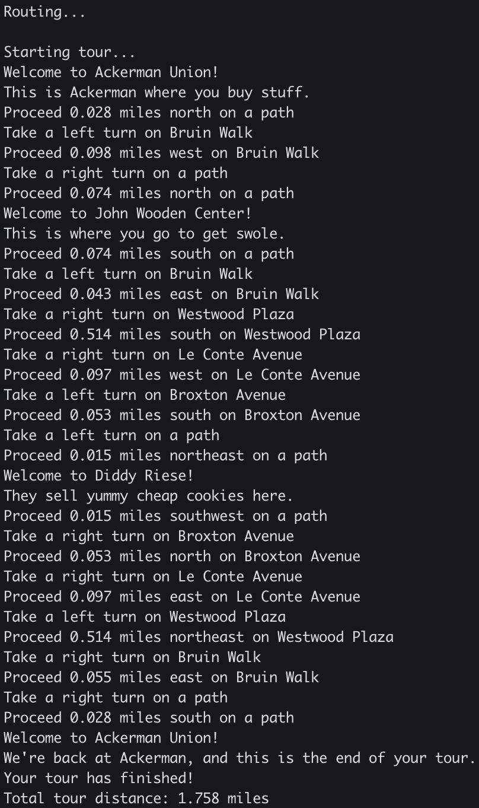

# BruinTour
BruinTour is a tour guide application focused on UCLA and the surrounding region of Westwood, LA and is built on OpenStreetMap data. Given a list of map coordinates and a list of tour stops, BruinTour creates an efficient and optimized route through the tour stops complete with moving and turning directions.

The street map data file **mapdata.txt** is divided into thousands of street segments, with each segment in the data file having a street name, the starting and ending coordinates (latitude, longitude) of the segment, the number of points of interest on the segment, and the names and locations of the points of interest. The tour stops data file **stops.txt** contains the name and description of each stop.

Some resources for making your own data files
- https://www.latlong.net
- https://wiki.openstreetmap.org/wiki/Downloading_data#Choose_your_region
- Your favorite business review app to find desired tour stops!

## Running the program
1. **Homebrew**: If you want to build with CMake, first install Homebrew by running:
    ```bash
    /bin/bash -c "$(curl -fsSL https://raw.githubusercontent.com/Homebrew/install/HEAD/install.sh)"
    ```
2. **CMake**: Then, install CMake by running:
    ```bash
    brew install cmake
    ```
3. Run the program by typing the following into the terminal:
    ```bash
    path/to/BruinTour path/to/mapdata.txt path/to/stops.txt
    ```

## Tour Example Through UCLA and Westwood, CA

